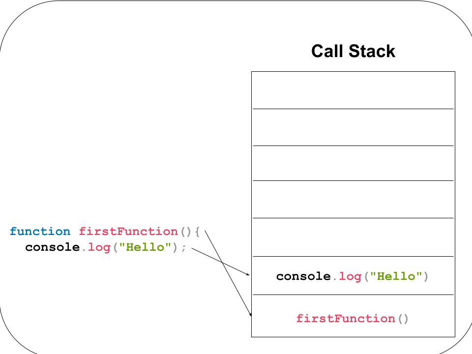

# Reading: Class 10 - In Memory Storage

## Understanding the JavaScript Call Stack

1. What is a ‘call’?

   It is a manage function invocation, in which a record is kept to ensure functions are run in order and removed when complete.

2. How many ‘calls’ can happen at once?

   Only one, as JavaScript is synchronous.

3. What does LIFO mean?

   Last in, first out. The last function place in the Stack in the first one to get completed.

4. Draw an example of a call stack and the functions that would need to be invoked to generate that call stack.

   

5. What causes a Stack Overflow?

   It can occur when a recursive function is called, causing an endless loop.

## JavaScript Error Messages

1. What is a ‘reference error’?

   This error occurs when a variable is referred to that has not yet been declared or is out of scope.

2. What is a ‘syntax error’?

   Syntax errors happen when a functional typo occurs in the code, causing the code to fail parsing through the interpreter.

3. What is a ‘range error’?

   This occurs when an object is given an invalid value for the range of acceptable values.

4. What is a ‘type error’?

   Type errors occur when an there is a type mismatch in using or accessing incompatible variables (e.g. numbers and strings).

5. What is a breakpoint?

   A Breakpoint is used to halt the code at a specific location, for the purpose of debugging or analyzing the code.

6. What does the word ‘debugger’ do in your code?

   It halts the execution of code and call the debugging function.

## Things I want to know more about

I'd like to learn more about the asynchronous aspects of JavaScript and how each interacts with the call stack and code execution.
