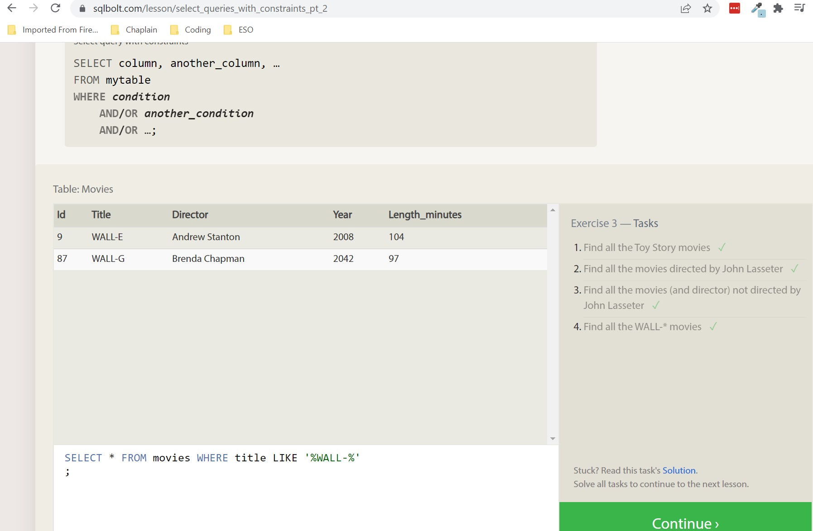

# Reading: Introduction to SQL

I have designed SQL databases since the mid-1990's and also used the SQL query language extensively to retrieve data while working in the military. SQL databases are exceptional when you need the various tables of data to have interconnected relationships and be able to search the data with those relationships in mind. The key to being successful with complex SQL databases is to thoroughly understand the SQL query language.

